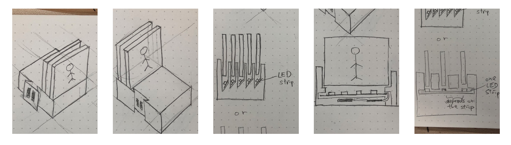
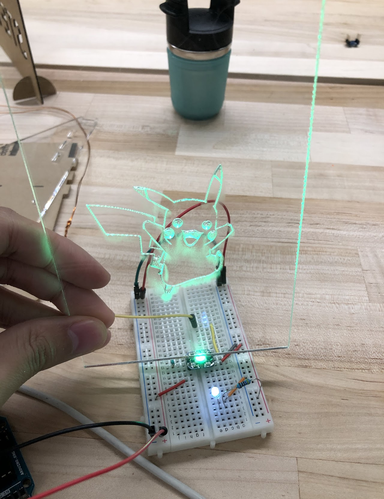
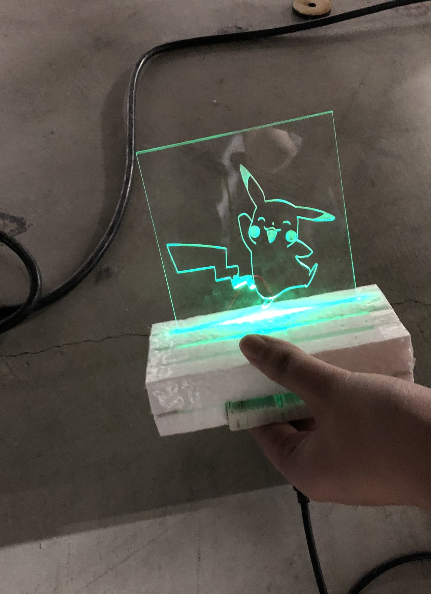

## Background

Blinker is a fun animated lighting idea for both children and adults. In blinker project, we have developed two lightguide display objects, with each having 3 engraved acrylic layers slotted in. Under each acrylic layer slot, an LED light is inserted. The engravings simulate an animation of a Pokémon (one object with Pikachu and the other one with Togepi engraving). Each object is attached to a dark background, making it looks like a theater, and allow the LED lights to appear brighter.

When the objects are not connected, only the first layer’s LED, of each, will be blinking. On the other hand, when the two objects are connected, each object will have its LEDs turn on and off, in sync with the other object, in a way that creates an animation from those engraved acrylics (two Pokémon dancing together).

## Process

We started with sketches of how all the components can be housed inside an enclosure and connect with another object. 

To test out the feasibility of the project, we started with a breadboard, an Arduino UNO, and NeoPixel. Since the Arduino UNO has female pins soldered in, **it is was convenient** to try the components on a breadboard. We made a sample clear acrylic with the NeoPixel, and the result was promising.

Then, we made a foam enclosure to test out to further test the feasibility. This shows a promising result that the project is indeed possible with the material we have. At the same time, we started exploring Arduino and how to program both the board and the NeoPixel light, and developed our first sketch; only one LED blinking.

After that, we created another foam enclosure to test out an enclosure with three slots, different acrylic etching pattern, and in different lighting conditions.  This shows that the pattern of the acrylic is more apparent in a dark condition. We also tested a smaller height and width of the acrylic to see if the light will be stronger. 

At this time, we created our second Arduino sketch with blinking LEDs, setting the brightness to the maximum, back and forth to be used to test with the acrylic layers.

Then we used the same previous foam with three slots painted black and with a cardboard background. The black paint on the base object didn’t really help with the light propagate better and didn’t make the pattern more apparently. The cardboard background helped make the pattern more apparently with the limited NeoPixels we had.

We also used the above test procedure to see what’s the effect with multiple acrylic stacked. We found out with deeper etch, the pattern is more apparent under light; however, when they are stacked, the layer in font would interfere with perception of the lit up layer in the back because the external light is reflecting the etch of the first layer. 

For the connectors, we decided to use two sets of male and female connector to make sure we have at least three connections for a common ground and two signal pins.

The first iteration of the slot mechanism to combine two objects. We started with a cylinder as the slot; however, a single slot was proven ineffective because we can tear of the connection on the other side. Also the gap of the small protoboard is very tight that the protoboard couldn’t be inserted all the way. We also put on mind testing the form and orientation of the final enclosure.

In the second connectors' iteration, we tested with two cylindrical slots. It was more secure, however, we were still able to pry two objects apart. The cylindrical slots didn’t provide enough surface to secure two objects given the size and geometry, especially the top half of the cycle in the cylinder is not providing any tension at all. We also realized the back wall of the object is time and material wasted. A pair of the test objects takes around five hours to print.

Moreover, in this iteration we changed the slot design from the cylinder to trapezoid in order to provide more area for friction. This design works pretty well that the two objects could slide in and out except the distance between the two actual connectors are too small that it was making the pair of objects hard to slide in and out. 

Since we decided our whole enclosure will be an object has a top part and a bottom part, we were testing the mechanism of breaking into top and bottom in this last iteration of the the test connector objects. Also we increased the spacing between the two protoboard, so contacts are easier to slide in and out. 

Below is a picture of all connectors iterations until the final version

by that time, we already had the first full code version to test

Here we were testing the code and the connection between two Arduino boards. It proved to us that the connection and the code works. However, we were surprised that the LED light, in the two boards, don't start at the same time; which made them out of sync. 

Investigating more about why these two were not syncing, we found that this is the normal behavior. Crystals differ in clock rate, even if they belong to the same type of boards. Also crystal get effected heavily by temperature and other environmental factors; this effects the sensitivity and the speed of "starting execution" time.  As a fact, it's nearly impossible to reach 100% sync rate. 

However, we really wanted to them to at least "appear" to be synced with around 2 milliseconds. We  made intensive research and got deep in Arduino world. We even wrote around 5 different approaches including "Master-slave"- I2C, no delay usage etc; none worked. 

After all these failed attempted, we decided to go by our own logic; it seemed a simple problem that needed a simple solution. We really wanted our project to be the simplest; even in coding. What we did was, we used millis() function to monitor clock rates used in the project. This helped us to calculate the difference between the two crystals in their current conditions. We added a delay time by the start of execution "when connected code"; however, this made the problem even worse. The two differed "crazily" in their lighting speed.

As one last try, we added a flag that only when the two first connected, the delay will be executed, and that worked like a charm !

Talking about our enclosure, it is mainly composed of three parts: background cover, base bottom and base top. The first two iterations of enclosure in the functional test were mainly made by foam. These two iterations have been described in the previous process. Before printing, we tested whether the print size of the base card slot is consistent with the protoboard.

After that, we began our final modeling in Fusion. The first printed version of the model was also divided into three parts: background cover, base bottom and base top. In this version of the model, the protoboards are inserted into the base using a sliding method. 

In this iteration, the battery was a fiction fit between the top and the bottom piece. Attaching a connector to the bottom piece didn’t provide enough structure integrity as it can snap off. To fasten the test objects, we would need to have many fasteners and bosses per object with that design. 

In the next iteration, we wanted to minimize screws needed to assemble the object and embed the existing connector design. The existing bottom-top structure was changed to a new bottom-top structure, as follows.

The design to hold the protoboard was changed from slot to sandwich. The protoboard is sandwiched between the top and the bottom part. The screws are used to fasten the top piece and the bottom piece with the protoboard in the middle. The capture nuts are placed on the top piece. The protoboard is also acted as a plane to hold the battery and the toggle switch in place. 

In the time of putting all inside components together, Although we tested in Arduino and on the Feather board with breadboard before, soldier everything neatly on a protoboard took longer than expected, especially when we have to solder two protoboards. 

The picture below shows the internal organization of the enclosure. 

The below picture shows how two objects are connected without the top