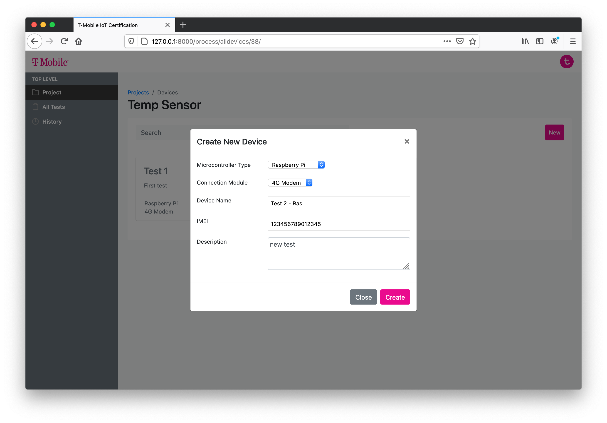

## Background

The project started in June last year. When picking the projects, I looked carefully at each of them and finally decided to make this my first choice. And I was assigned with four other teammates: Alvaro, Vivian, Yida, and Wenyuan. I have never worked with any of them before, but I was looking forward to it. We meet mostly virtually, via Zoom and Microsoft Teams. And we work mostly virtually, using GitHub and Google Drive to share our work. Pandemic stopped us from seeing each other physically, but it cannot stop us from working together.

## User Research

In the first quarter, we mostly work on user research. At that time, we are also new to the team and need some time to learn more about each other. We did have conflicts, but we sat down and talk about those problems instead of ignoring them; the result is satisfying: we found our best way to collaborate in the end.
Through primary and secondary research, we learned a lot more about IoT certification. With the help of our sponsor, we were able to interview professionals on IoT certification and saw how they think about the problem. After each interview, we will have a virtual meeting to discuss and analyze our findings. Before milestone 3 last quarter, we presented our sponsor with some proposals about how we think can help with the current IoT certification process and our sponsor showed particular interest in the idea of "Certification Kit for Solutions with Modems". There was not too much time left for us before the deadline, and we started sketching and developing the demo right away.

At the end of last quarter, we were able to finish a demo of our idea. I was working with Yida and Wenyuan together on the software development, Alvaro was working on the hardware, and Vivian was working on the final presentation and video. We spent almost every second of our time after class, but it was worth it.

Going into the second quarter, we now need to refine our prototype. To speed up our prototype development, we split our team into two and assigned each person with clear tasks on what they need to do. Yida and Vivian were responsible for interviews and UI/UX design, and the rest of us were responsible for the prototype development. I was working together with Wenyuan on web development while Alvaro was in charge of testing out different modems. We also refined our software and hardware diagrams based on the feedback we have and the tools we were using.

Based on the interview feedback, our research team would adjust the prototype UI/UX design, and our software team will then make changes to our website. After several iterations, we successfully implemented the core functions and design of our project using tools like Django, Firebase, jQuery, etc.

Here are some screenshots from our prototype:

